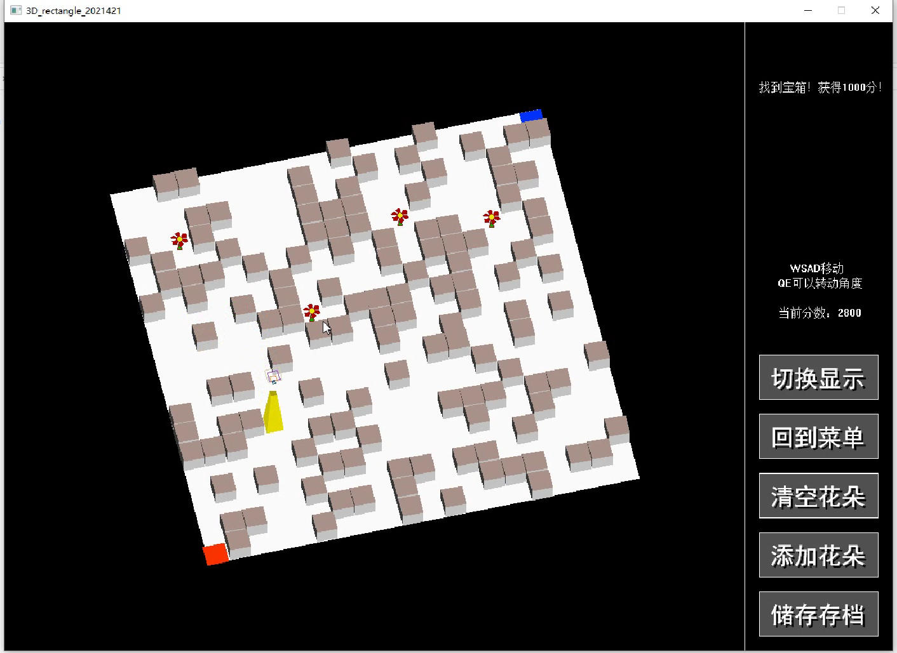

```markdown
# 3D Maze Game (C++ & EasyX)

A 3D perspective maze game I independently developed using C++ and the EasyX graphics library.  
This project was built after I had just learned C, and marked my first large-scale program (~1800 lines in a single file back then 😅).  
It simulates 3D scene rendering, map generation, and real-time game interaction.

## 🎮 Demo Video

▶️ [Watch the gameplay video (2 min)](https://drive.google.com/file/d/14WebmyDFr55lXDdrRdtyyttKRkZctNzo/view?usp=drive_link)

## ✨ Features

- 🌀 Simulated 3D rotation & projection using custom matrix logic
- 🧱 Dynamic maze generation with path validity check
- 🧍‍♂️ Smooth character animation with real-time movement
- 💎 Treasure system (bonus/penalty items) with score tracking
- 💾 Save & Load game state using file I/O
- 🖱️ Fully interactive UI (menus, mouse events, keyboard control)
- 📦 All implemented using pure C++ and EasyX (Windows-only)

## 📷 Screenshot



## 🛠️ Tech Stack

- Language: C++
- Graphics: EasyX (Win32 GDI)
- Features: Coordinate transformation, linked list, UI, animation
- Lines of Code: ~1800 (initial version written in one .cpp file!)

## 📁 Project Structure

```
3D-EasyX-Maze-Game-Cpp/
├── src/               # All source code
├── screenshot.png     # Gameplay screenshot
├── README.md
├── LICENSE            # MIT License
└── .gitignore
```

## 💡 About the Project

This game was created purely based on my curiosity and love for programming. At the time, I had no idea how to split code into multiple files, and I learned many concepts (graphics rendering, logic control, state management) on the go.

Now looking back, I see this project as my first "mini engine" — a personal milestone in my programming journey.

## 👨‍💻 Author

**Ossanoda**  
[GitHub](https://github.com/Ossanoda)

## 📝 License

This project is licensed under the MIT License.
```